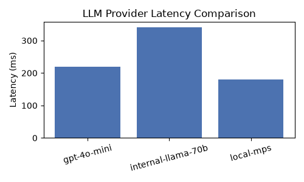

# LLM Provider Benchmark Notes

This document summarizes a small internal benchmark comparing LLM provider
latency across the three profiles we support: a hosted API, an internal
gateway, and a local model running on-device.

We measured average response latency for a fixed 200-token completion
prompt, run ten times per provider and averaged.

| Provider | Model | Avg Latency (ms) |
| --- | --- | --- |
| OpenAI (hosted) | gpt-4o-mini | 220 |
| Internal gateway | internal-llama-70b | 340 |
| Local (MPS) | all-MiniLM-L6-v2 | 180 |

The chart below plots the same numbers for a quick visual comparison.

Local inference was fastest for this workload, though it's worth noting the
internal gateway numbers include network round-trip time within the
company's data center, which the local case has by definition.
